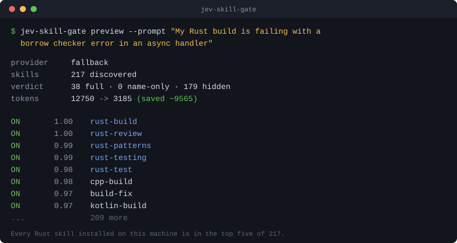

# jev-skill-gate

Claude Code loads every skill description into context at session start, whether or not the skill has anything to do with what you are working on. On a machine with a full skills library that is roughly 10,000 tokens spent before you type anything.

`jev-skill-gate` scores each skill against the project you are actually in, then writes `skillOverrides` so only relevant skills reach the model. Scoring runs on [TypeSafe's Jev](https://typesafe.ai), a decision model that returns calibrated probabilities instead of text, in one parallel pass over all your skills.



## Does it pick the right skills?

That is the only question that matters — a gate that saves tokens by hiding what you needed is worse than no gate. So there is a committed eval, not a claim.

**20 labeled cases · 217 installed skills · every label validated against the live inventory before the run.** Each case lists skills that *should* rank high and skills that are unambiguously irrelevant. State is the **prompt only**, with no project signals helping, which is the harder test.

| Metric | Local scorer (free) | Jev (partial run) |
| --- | --- | --- |
| Mean pairwise AUC | **0.961** | not yet measured across all cases |
| Cases with perfect separation | 14 / 18 | — |
| Median rank of an expected skill | **4** of 217 | 1–3 for primary skills |
| Irrelevant skills reaching any top 10 | **0** | 0 in any top 5 |
| Expected skills surviving the gate | **92.9%** | — |
| Skills hidden on a contentless prompt | **0** | — |

AUC is the share of (expected, irrelevant) pairs where the expected skill scored higher. 1.0 is perfect, 0.5 is a coin flip.

Full report: **[eval/RESULTS.md](eval/RESULTS.md)** · raw scores: [eval/raw-scores.json](eval/raw-scores.json) · cases: [eval/cases.json](eval/cases.json) · inventory: [eval/skills-inventory.tsv](eval/skills-inventory.tsv)

```bash
node eval/run-eval.mjs --local --fresh   # free, no key, ~2 seconds
node eval/run-eval.mjs --reuse           # re-derive every number from committed scores
```

### What Jev buys over the free scorer

Jev scored 5 of 6 scenarios before the account's free-tier quota ran out. Those numbers are in **[eval/JEV-PARTIAL.md](eval/JEV-PARTIAL.md)**, and the missing scenario is left blank rather than estimated.

Where the two differ is instructive. The local TF-IDF scorer hid five labeled skills, **every one at a score of exactly 0.00** — meaning zero literal word overlap:

| Prompt | Skill it hid |
| --- | --- |
| "CMake build failing, template instantiation error" | `cpp-review` |
| "Audit this Laravel app for SQL injection" | `security-review` |
| "Write a blog post and adapt it for LinkedIn and X" | `x-api` |

These are obvious semantic matches with no shared vocabulary. That is precisely the gap a model closes and a bag-of-words cannot. Jev put `security-review` at 0.93 on the Django auth prompt, where TF-IDF scored the same skill 0.00 on a near-identical Laravel one.

### How much is saved, and how

The saving is not a guess — it is the sum of the description tokens for every skill moved out of full visibility.

| | tokens |
| --- | --- |
| 217 discoverable skills, full manifest | **12,750** |
| after gating a Rust prompt | **3,185** |
| saved | **9,565 (75%)** |

Per skill, the three states cost:

| State | Cost | Claude sees |
| --- | --- | --- |
| `on` | full description, ~60 tokens | name + description |
| `name-only` | ~3 tokens | name |
| `user-invocable-only` | 0 tokens | nothing |

`/context` reports 9.9k for skills on this machine against the 12,750 estimated here; the estimator counts characters at 3.8/token and runs slightly high. The *savings ratio* is what transfers, not the absolute figure.

Cost to compute: **one Jev request per session**, 217 questions in a single parallel pass, ~17.7k input tokens, **$0.00074**, cached for 7 days.

## What it actually changes

Claude Code's `skillOverrides` setting has four states. This tool maps a relevance score onto three of them:

| State | What Claude sees | In your `/` menu |
|---|---|---|
| `on` *(default, never written)* | name + description | yes |
| `name-only` | name only, ~3 tokens | yes |
| `user-invocable-only` | **nothing** | yes |
| `off` | nothing | hidden |

**It never writes `off`.** Hiding a skill from Claude is reversible by typing `/skill-name`; hiding it from you as well is not. A wrong call costs tokens you wanted to spend, never access.

## Install

Requires Node 18+. No dependencies.

```bash
git clone https://github.com/ShivamPansuriya/jev-skill-gate.git
cd jev-skill-gate
node bin/jev-skill-gate.mjs install
```

That registers a `SessionStart` hook in `~/.claude/settings.json`, merging into any hooks you already have.

Optionally set a key. Without one it uses a built-in local scorer and still works:

```bash
export AI_GATEWAY_API_KEY=vck_...   # via Vercel AI Gateway
export TYPESAFE_API_KEY=sk-...      # or TypeSafe direct
```

Or store it in the config file, which is written mode 0600:

```bash
jev-skill-gate config --provider gateway --api-key vck_... 
jev-skill-gate config --provider gateway --base-url https://my-proxy.internal
jev-skill-gate config                    # show current settings, keys masked
```

**An environment variable always wins over the config file.** Env is the better home for a credential: per-shell, easy to rotate, and it cannot end up in a file you commit by accident.

### Providers

Both transports are supported and the differences are handled for you:

| | Vercel AI Gateway | TypeSafe direct |
|---|---|---|
| Endpoint | `POST {base}/v4/ai/evaluation-model` | `POST {base}/systemone` |
| Default base URL | `https://ai-gateway.vercel.sh` | `https://api.typesafe.ai/v1` |
| Model | `ai-model-id` **header** | `model` in the body |
| Primitive name | `boolean` | `noul` |
| Answer field | `probability` | `noul` |
| Default model | `typesafe-ai/jev` | `jev-latest` |

`--base-url` lets you point either transport at a corporate proxy or a local mock.

## Use

```bash
jev-skill-gate doctor      # check setup, see what was discovered
jev-skill-gate preview     # score and show the plan, write nothing
jev-skill-gate apply       # write skillOverrides
jev-skill-gate restore     # put skillOverrides back exactly as it was
jev-skill-gate uninstall   # remove the hook and restore
```

`preview` is the one to run first. It prints every skill with its score and the state it would get.

## How it decides

At `SessionStart` there is no user prompt yet, so relevance is judged against what the project *is*: detected stack, top-level layout, current branch, recent commit subjects, dependency names, and a README excerpt. That becomes the `state` for a single Jev call carrying one `noul` question per skill — all evaluated in parallel against one shared read.

Jev's probabilities are calibrated (trained with RLCD, which optimises probability against outcome rather than human preference), so a threshold is a meaningful control surface:

```
p >= 0.60  ->  on                   full description
p >= 0.25  ->  name-only            cheap breadcrumb
p <  0.25  ->  user-invocable-only  hidden from Claude, /name still works
```

Cost is about **$0.0005 per session** at $0.042/1M input tokens, and results are cached for 7 days keyed on a content hash of your skills plus the project signals.

## Safety behaviour

Hiding a skill is silent — Claude never learns it existed — so every ambiguous case fails open:

- **Thin signal bails out entirely.** An empty or brand-new directory produces almost no evidence, so nothing is hidden at all.
- **Unscored skills stay visible.** If the provider skips a question, that skill keeps its full description.
- **Provider failure degrades, never blocks.** A dead key, a timeout or a 500 falls through to the local scorer. A broken gate cannot stop a session from starting.
- **Your own overrides are never touched.** Anything you set by hand is recorded and preserved; only keys this tool wrote are rewritten.
- **`restore` is exact.** The original `skillOverrides` is snapshotted before the first run.
- **Bundled skills are never gated.** `/debug`, `/code-review` and friends live inside the Claude Code binary and cannot be enumerated from disk, so they are left alone.

## The local scorer

With no API key, a TF-IDF cosine ranker over skill names and descriptions runs instead. It is useful, and it is not Jev: it produces **ranks, not probabilities**. The planner knows the difference and switches from thresholds to a fixed top-N slice, because thresholding a rank is meaningless.

It is also worth running deliberately as a baseline. If it gets you 90% of the way on your own skill library, you do not need the API call.

## Configuration

Optional, at `~/.claude/jev-skill-gate.json`:

```json
{
  "thresholds": { "on": 0.6, "nameOnly": 0.25 },
  "maxOn": 40,
  "maxNameOnly": 60,
  "alwaysOn": ["my-critical-skill"],
  "ignore": ["skill-to-leave-completely-alone"],
  "scope": "auto",
  "cacheTtlHours": 168
}
```

- `alwaysOn` — kept at full visibility whatever the score.
- `ignore` — no override written at all.
- `scope` — `auto` writes project-local (`.claude/settings.local.json`) when you are in a project, user-level otherwise. Relevance is a property of the project, so project-local is usually right.

## Per-prompt gating

The manifest is built during skill discovery, before any prompt exists, and hooks can add context but never subtract it. So per-prompt gating cannot rewrite the manifest.

What the `UserPromptSubmit` mode does instead is surface skills that scored high for *this request* but are currently reduced, as `additionalContext`. Claude can still invoke them. Enable with:

```bash
node bin/jev-skill-gate.mjs install --event UserPromptSubmit
```

This appends to the user turn rather than the system prompt, so it does not invalidate the prompt cache. Run it alongside the `SessionStart` hook, not instead of it.

## Verified against

Claude Code v2.1.274. The mechanisms used — `skillOverrides`, `reloadSkills` on `SessionStart`, `enabledPlugins`, `installed_plugins.json` — are documented or stable on-disk formats. No binary patching: Claude Code ships as a compiled single-file executable whose JS lives in a string-constant pool, and it releases every few days.

## License

MIT
